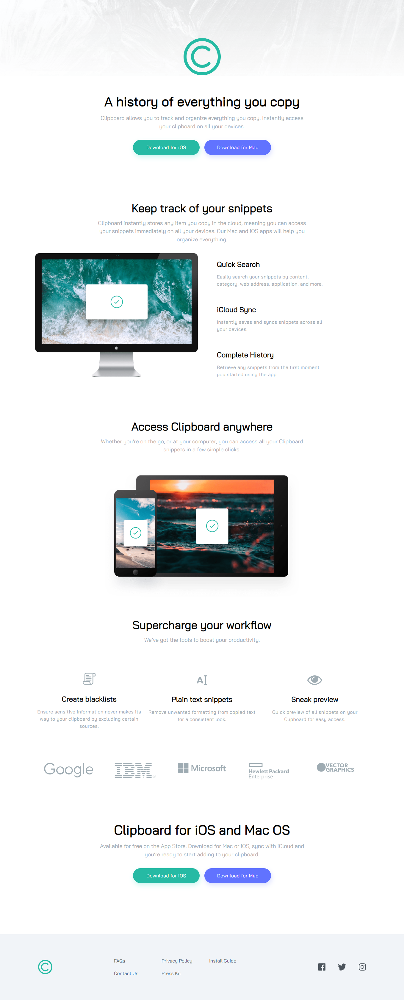
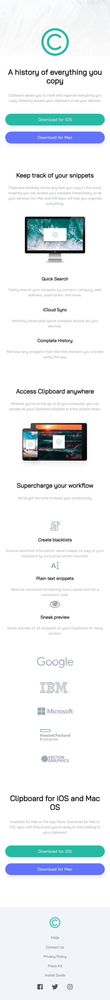

# Frontend Mentor - Clipboard landing page solution

This is a solution to the [Clipboard landing page challenge on Frontend Mentor](https://www.frontendmentor.io/challenges/clipboard-landing-page-5cc9bccd6c4c91111378ecb9). Frontend Mentor challenges help you improve your coding skills by building realistic projects. 

## Table of contents

- [Overview](#overview)
  - [The challenge](#the-challenge)
  - [Screenshot](#screenshot)
  - [Links](#links)
- [My process](#my-process)
  - [Built with](#built-with)
  - [Continued development](#continued-development)
- [Author](#author)

## Overview

### The challenge

Users should be able to:

- See hover and focus states for all interactive elements on the page

### Screenshot

***

### Links

- Solution URL: [Solution](https://github.com/Tori-Bemide/clipboard-landing-page)
- Live Site URL: [Live Server](https://tori-bemide.github.io/clipboard-landing-page/)

## My process

### Built with

- Semantic HTML5 markup
- CSS custom properties
- Flexbox
- CSS Grid
- Mobile-first workflow

### Continued development

Looking to improve on CSS Flexbox and CSS Grid

## Author

- Frontend Mentor - [Timony](https://www.frontendmentor.io/profile/Tori-Bemide)
- Twitter - [Tori Bemide](https://x.com/Tori-Bemide)